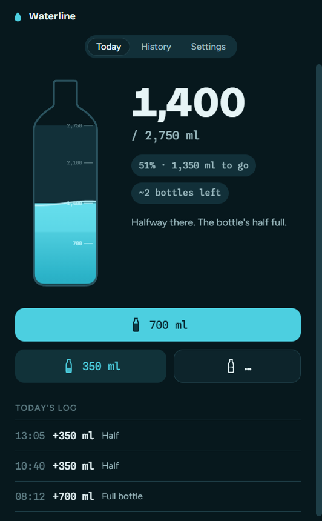
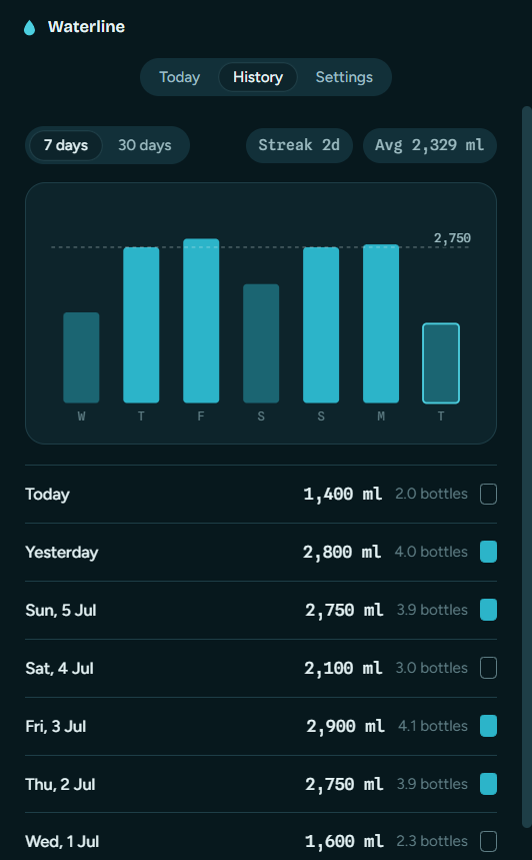
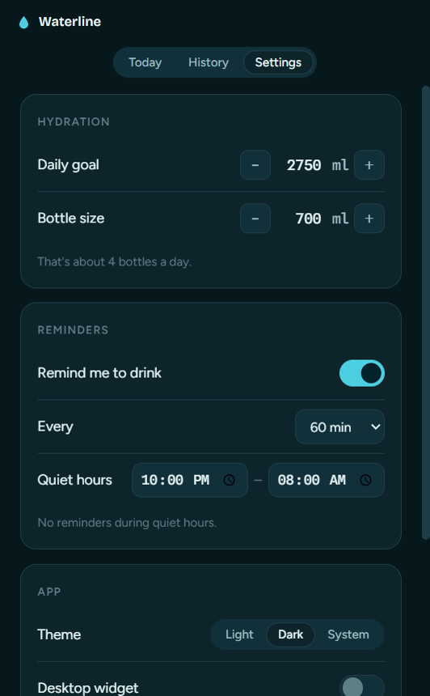
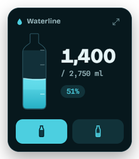
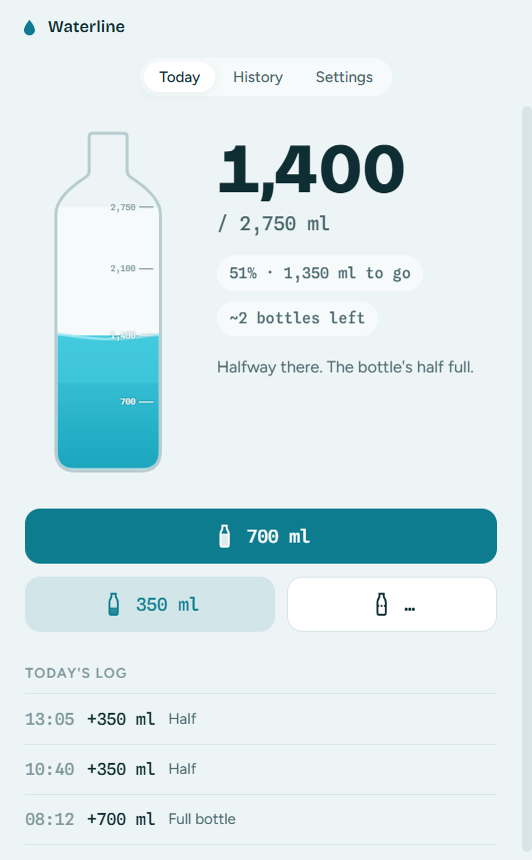

# 💧 Waterline

A calm desktop **water-drinking reminder & hydration tracker** for Windows, built with Electron.

Waterline is styled like laboratory glassware — a graduated bottle that literally fills as you drink, precise mono numerals, and a quiet, focused interface that stays out of your way. Log a drink in one tap, watch the bottle rise, and get gentle nudges so you actually hit your daily goal.



## Features

- **Graduated fill-bottle** hero that fills in real time, with etched tick marks at every bottle and your daily goal.
- **One-tap logging** — full bottle, half, or a custom amount — with an undo toast and a timestamped daily log.
- **Hydration debt & pace** — see how far ahead or behind you are *right now* ("Behind by 320 ml — expected ~1,550 by now"), plus a "Pace today" chart of your expected vs. actual cumulative intake, so you catch a slow day before you feel it.
- **Daily history** — a 7 / 30-day bar chart with your goal line, current streak, daily average, and goal-hit badges.
- **Log or edit any past day** — click a day in History (or pick any date) to add, adjust, or remove timed entries and backfill what you missed.
- **Export a report** — a printable PDF summary, a CSV for spreadsheets, or a full JSON backup, over all time or the last 7 / 30 days.
- **Native reminders** — desktop notifications on your schedule, paused during quiet hours and once you've hit your goal, plus a once-a-day "goal reached" celebration. An event-aligned scheduler wakes only when it needs to, so the app stays idle in the background.
- **Pinned desktop widget** — a compact panel that sits on the desktop behind your windows, so you can log a drink without opening the app.
- **Light & dark themes** (dark is the flagship), a **Low power mode** (fewer animations, no GPU acceleration), editable daily goal and bottle size, launch-at-startup, and a system-tray presence.
- Runs fully offline; data lives in a local JSON file and fonts are bundled at build time.

## Screenshots

| Today | History | Settings |
|:---:|:---:|:---:|
|  |  |  |

<p align="center">
  
  &nbsp;&nbsp;&nbsp;
  
</p>

## Getting started

Requires **Node.js 18+**.

```bash
git clone https://github.com/bhairavi-ndev/waterline.git
cd waterline
npm install      # also generates the app icon and downloads the bundled fonts
npm start
```

> The app icon is generated locally (zero dependencies) and the fonts are fetched
> from Google Fonts on install. If you're offline, the app still runs and falls
> back to system fonts — run `npm run assets` later to regenerate them.

## Build a Windows installer

```bash
npm run dist
```

Produces a per-user NSIS installer at `dist/Waterline-Setup-<version>.exe` — you
choose the install folder and which shortcuts (Desktop / Start Menu) to create,
and no administrator rights are required.

## Usage notes

- Closing the window keeps Waterline running in the system tray (toggle in **Settings → App**). Quit from the tray menu.
- Set your **daily goal** (default 2,750 ml) and **bottle size** (default 700 ml) in Settings — type the numbers directly or use the − / + steppers.
- Enable the **desktop widget** in Settings or the tray; drag it by its top strip and it remembers where you put it.

## Project layout

```
src/
  main.js              Electron main process — windows, tray, IPC, widget, export
  reminders.js         Event-aligned reminder scheduler (pure timing, unit-tested)
  report.js            Report assembly — CSV / JSON / printable-HTML builders
  preload.js           Secure contextBridge API
  store.js             JSON persistence (userData/waterline.json)
  renderer/            Main window UI (index.html, styles.css, renderer.js)
    pace.js            Hydration-debt / pace math (pure, unit-tested)
    widget.html/.css/.js   Pinned desktop widget
  *.test.js            node:test unit tests (run with `npm test`)
build/
  make-icons.js        Zero-dependency water-drop icon / .ico generator
  fetch-fonts.js       Downloads and bundles the woff2 fonts
electron-builder.yml   Installer configuration
build/installer.nsh    Custom NSIS "choose shortcuts" page
```

## Tech

Electron · vanilla HTML / CSS / JS (no UI framework) · [electron-builder](https://www.electron.build/).

Bundled fonts (SIL Open Font License):
[Bricolage Grotesque](https://fonts.google.com/specimen/Bricolage+Grotesque),
[Figtree](https://fonts.google.com/specimen/Figtree),
[Spline Sans Mono](https://fonts.google.com/specimen/Spline+Sans+Mono).

## License

[MIT](LICENSE) © bhairavi-ndev
